# Fenyr AI Trading Agent

<div align="center">


[](https://www.python.org/)
[](https://openai.com/)
[](https://www.weex.com/)
[](LICENSE)

**Autonomous AI Trading Agent powered by GPT-5.2**

*Built for [AI Wars: WEEX Alpha Awakens](https://www.weex.com/events/promo/aiwars) Hackathon*

[Features](#-features) • [Architecture](#-architecture) • [Quick Start](#-quick-start) • [API Reference](#-api-reference) • [Contributing](#-contributing)

</div>

---

## 🎯 Overview

Fenyr is a production-grade AI trading agent that leverages **OpenAI's GPT-5.2** model to autonomously analyze cryptocurrency markets and execute trades on WEEX Exchange. Using advanced function calling capabilities, Fenyr can:

- Fetch and analyze real-time market data
- Calculate technical indicators (RSI, EMA, MACD)
- Make data-driven trading decisions
- Execute trades with full reasoning transparency
- Upload AI logs for competition compliance

## ✨ Features

| Feature | Description |
|---------|-------------|
| 🧠 **GPT-5.2 Integration** | Latest OpenAI model for superior market analysis |
| 🔧 **Function Calling** | AI directly invokes trading functions |
| 📊 **Technical Analysis** | RSI, EMA, MACD, Bollinger Bands |
| 🔄 **Multi-Strategy** | Momentum, Mean Reversion, Funding Arbitrage |
| 📝 **AI Log Compliance** | Automatic logging for WEEX AI Wars |
| 🛡️ **Risk Management** | Position sizing, stop-loss, take-profit |
| ⚡ **Real-time Execution** | Market orders with sub-second latency |

## 🏗️ Architecture

```mermaid
flowchart TB
    subgraph Input["📥 Data Input"]
        MD[Market Data API]
        TI[Technical Indicators]
        AS[Account Status]
    end

    subgraph Agent["🤖 Fenyr Agent"]
        GPT[GPT-5.2 Engine]
        FC[Function Calling]
        DM[Decision Making]
    end

    subgraph Execution["⚡ Trade Execution"]
        OE[Order Executor]
        RM[Risk Manager]
        AL[AI Log Uploader]
    end

    subgraph WEEX["🌐 WEEX Exchange"]
        API[REST API]
        WS[WebSocket]
    end

    MD --> GPT
    TI --> GPT
    AS --> GPT
    GPT --> FC
    FC --> DM
    DM --> OE
    DM --> RM
    OE --> API
    RM --> OE
    OE --> AL
    AL --> API
```



## 🔄 Trading Flow


## 🚀 Quick Start

### Prerequisites

- Python 3.11+
- OpenAI API key (GPT-5.2 access)
- WEEX API credentials

### Installation

```bash
# Clone the repository
git clone https://github.com/Miny-Labs/fenyr-trading-agent.git
cd fenyr-trading-agent

# Install dependencies
pip install -r requirements.txt

# Configure API keys
cp config.example.py config.py
# Edit config.py with your credentials
```

### Configuration

```python
# config.py
OPENAI_API_KEY = "sk-..."        # Your OpenAI API key
WEEX_API_KEY = "weex_..."        # WEEX competition API key
WEEX_SECRET_KEY = "..."          # WEEX secret key
WEEX_PASSPHRASE = "..."          # WEEX passphrase

GPT_MODEL = "gpt-5.2"            # Model to use
MAX_POSITION_SIZE_BTC = 0.0002   # Max position size
MAX_LEVERAGE = 20                # Competition limit
```

### Running

```bash
# Single analysis cycle
python main.py --mode single --symbol cmt_btcusdt

# Demo mode (shows all capabilities)
python main.py --mode demo

# Continuous trading (every 5 minutes)
python main.py --mode continuous --interval 300
```

## 📊 Supported Strategies


| Strategy | Signal | Action |
|----------|--------|--------|
| **RSI Mean Reversion** | RSI < 30 (oversold) | Open Long |
| **RSI Mean Reversion** | RSI > 70 (overbought) | Open Short |
| **Momentum** | EMA20 crosses above EMA50 | Open Long |
| **Momentum** | EMA20 crosses below EMA50 | Open Short |
| **Funding Arbitrage** | Funding > 0.1% | Short to collect |
| **Funding Arbitrage** | Funding < -0.1% | Long to collect |

## 📖 API Reference

### WeexClient

```python
from weex_client import WeexClient

client = WeexClient(api_key, secret_key, passphrase, base_url)

# Market Data
client.get_ticker("cmt_btcusdt")      # Current price
client.get_depth("cmt_btcusdt")       # Orderbook
client.get_candles("cmt_btcusdt")     # OHLCV data

# Account
client.get_assets()                    # Balance
client.get_positions()                 # Open positions

# Trading
client.place_order(symbol, size, side, order_type)
client.cancel_order(symbol, order_id)

# AI Log (Competition)
client.upload_ai_log(stage, model, input_data, output_data, explanation)
```

### FenyrAgent

```python
from ai_trader import FenyrAgent

agent = FenyrAgent(
    openai_api_key="sk-...",
    weex_client=client,
    model="gpt-5.2",
    max_position_size=0.0002
)

# Single analysis
result = agent.analyze_and_trade("Analyze BTC market conditions")

# Continuous trading
agent.run_continuous(interval_seconds=300)
```

## 🔐 AI Log Compliance

Every trade decision is automatically logged to WEEX:

```python
{
    "stage": "Strategy Generation",
    "model": "gpt-5.2",
    "input": {
        "market_data": {"price": 88800, "rsi": 67.65},
        "prompt": "Analyze BTC conditions..."
    },
    "output": {
        "signal": "OPEN_LONG",
        "confidence": 0.74,
        "order_id": "701820686989000728"
    },
    "explanation": "RSI at 67.65 with bullish EMA crossover..."
}
```

## 🛡️ Risk Management

```mermaid
flowchart LR
    subgraph Risk["Risk Controls"]
        PS[Position Sizing]
        SL[Stop Loss]
        TP[Take Profit]
        ML[Max Leverage]
    end

    PS --> |"< 2% account"| CHECK{Validate}
    SL --> |"2% below entry"| CHECK
    TP --> |"4% above entry"| CHECK
    ML --> |"≤ 20x"| CHECK
    
    CHECK --> |Pass| TRADE[Execute Trade]
    CHECK --> |Fail| REJECT[Reject Order]
```



## 📁 Project Structure

```
fenyr-trading-agent/
├── README.md              # This file
├── LICENSE                # MIT License
├── CONTRIBUTING.md        # Contribution guidelines
├── requirements.txt       # Python dependencies
├── config.example.py      # Configuration template
├── config.py              # Your configuration (gitignored)
│
├── main.py                # Entry point
├── ai_trader.py           # Fenyr agent core
├── weex_client.py         # WEEX API client
├── tools.py               # GPT function definitions
│
└── logs/                  # Trading logs (gitignored)
```

## 🤝 Contributing

We welcome contributions! Please see [CONTRIBUTING.md](CONTRIBUTING.md) for guidelines.

## 📜 License

This project is licensed under the MIT License - see [LICENSE](LICENSE) for details.

## 🏆 Hackathon

Built for **AI Wars: WEEX Alpha Awakens**
- Prize Pool: $880,000 USD
- Competition Period: Dec 2025 - Jan 2026

## 🔗 Related Projects

- [WEEX Rust SDK](https://github.com/Miny-Labs/weex-rust-sdk) - Rust SDK for WEEX Exchange
- [crates.io: weex_rust_sdk](https://crates.io/crates/weex_rust_sdk) - Published Rust package

---

<div align="center">

**Made with 🤖 by [Miny Labs](https://github.com/Miny-Labs)**

</div>
